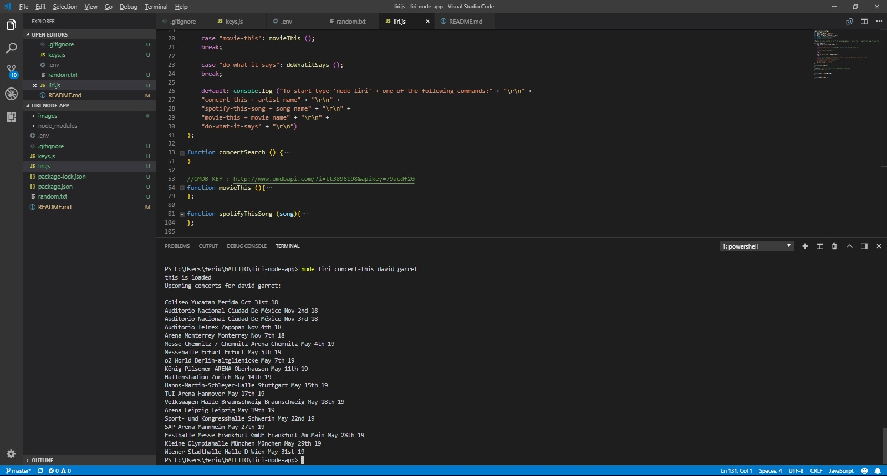
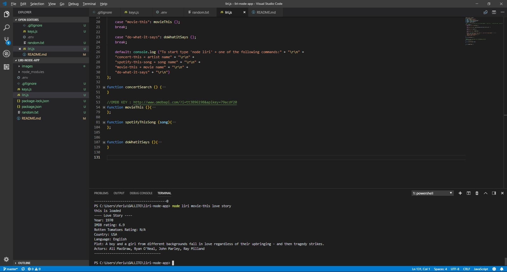
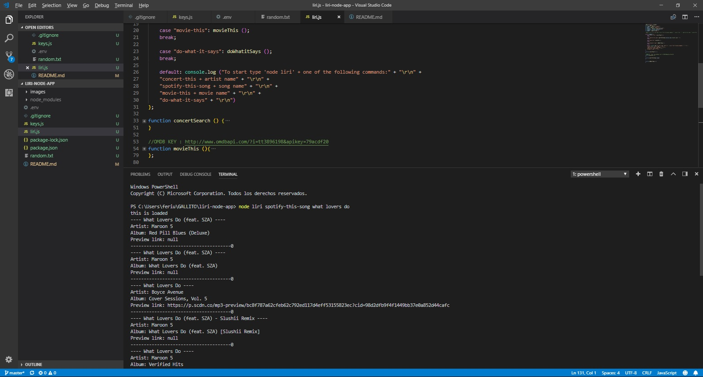
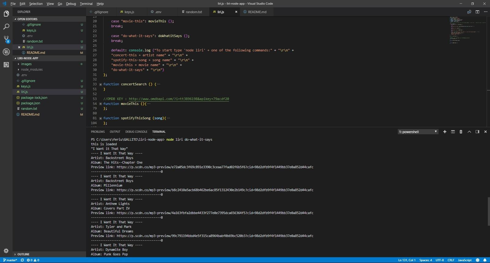

# liri-node-app
To start the user has to do as follows: 
1. In the terminal write npm install
2. Type "node liri" and one of the following options
    a. spotify-this-song + a song of your selection to see:
       * Artist(s)
       * The song's name
       * A preview link of the song from Spotify
       * The album that the song is from
    b. movie-this + a movie of your selection to see:
       * Title of the movie.
       * Year the movie came out.
       * IMDB Rating of the movie.
       * Rotten Tomatoes Rating of the movie.
       * Country where the movie was produced.
       * Language of the movie.
       * Plot of the movie.
       * Actors in the movie.
    c. concert-this + a singer of your selection to see: 
       * Name of the venue
       * Venue location
       * Date of the Event
    d. do-what-it-says 
    It will retrieve the information on random.txt and follow whatever order has been written there. 

    EXAMPLES: 
    
    
    
    
    
